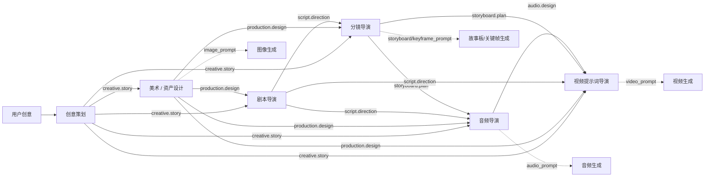

# Workflow Agent 能力、Prompt 与调用顺序清单

**版本：** v1  
**日期：** 2026-08-12  
**适用范围：** Ryan Workflow Agent 视频创作流程

## 1. 设计总览

当前设计实际包含 **六类 Agent**，不是五类：

```text
创意策划
  → 美术 / 资产设计
  → 剧本导演
  → 分镜导演
  → 音频导演
  → 视频提示词导演
```

每个 Agent 的正式提交包含两部分：

1. **Canonical Markdown 正文**：用户可读的阶段结论、依据、连续性和下游交接。
2. **可选 `ryan-artifact` Bundle**：只存放确实需要连接生成节点的结构化 Prompt。

Prompt 不是 Agent 的全部输出。故事依据、视觉锁、剧本、镜头计划和音频设计默认保留在 Canonical 正文中，不能全部改写成 Prompt。

---

## 2. 六类 Agent 总览

| 顺序 | Agent | `context_kind` | 主要能力 | 可输出 Prompt | 主要下游 |
|---|---|---|---|---|---|
| 1 | 创意策划 | `creative.story` | 故事创意、主题、角色功能、Story Beats、节奏骨架 | `concept_image_prompt` | 美术、剧本 |
| 2 | 美术 / 资产设计 | `production.design` | 角色、场景、道具、空间、视觉风格和 Continuity | `image_prompt` | 分镜、剧本、视频 |
| 3 | 剧本导演 | `script.direction` | 场次、动作、对白、Blocking、表演和情绪连续性 | 无 | 分镜、音频、视频 |
| 4 | 分镜导演 | `storyboard.plan` | Scene → Shot → Segment、镜头、首尾状态和关键帧规划 | `storyboard_prompt`、`keyframe_prompt` | 音频、视频、图像节点 |
| 5 | 音频导演 | `audio.design` | 对白、音乐、拟音、环境音、静默和节拍同步；主要为视频 Prompt 提供声音依据 | `audio_prompt`（按需） | 视频、音频节点 |
| 6 | 视频提示词导演 | `video.prompts` | 综合上游结果，生成逐 Segment 的执行型视频 Prompt | `video_prompt` | 视频生成节点 |

统一合同：

| 项目 | 规则 |
|---|---|
| 正文 | 每个 Agent 每次 Commit 只提交一份中文 Canonical 文档 |
| Bundle | 每个 Agent 最多附带一个 `ryan-artifact` Bundle |
| Prompt 正文 | 使用唯一的中文 `text` 字段 |
| Prompt 必填字段 | `output_id`、`kind`、`label`、`purpose`、`target_ids`、`text` |
| 上下文摘要 | `content.summary`、`content.handoff`、`content.locks` |
| 默认行为 | 没有真实生成需求时，`outputs: []`、`shots: []` |

---

## 3. Agent 详细能力与 Prompt 清单

### 3.1 创意策划

### 能提供的能力

- 整理项目意图、创作模式和目标时长。
- 提炼 Logline、主题、情绪目标和观众体验。
- 定义角色的叙事功能和核心动机。
- 建立 `Story Beats`：Setup、Escalation、Climax、Ending、Payoff。
- 设计信息释放顺序、节奏和冲突升级。
- 标记必须保留的故事事实、角色关系和道具关系。
- 标记必须避免的内容，例如改变动机、随意新增反派或破坏结局。
- 提供必要的整体视觉方向。
- 向美术和剧本交接故事锁、角色功能和 Beats。

### Canonical 正文应包含

```text
项目意图
故事核心 / 主题 / 情绪
角色叙事功能
Story Beats
时长与节奏
必须保留 / 必须避免
整体视觉方向
下游交接
```

### 可输出 Prompt

| `kind` | `purpose` | `target_ids` | 用途 |
|---|---|---|---|
| `concept_image_prompt` | `concept_art`、`moodboard` | 通常为 `PROJECT` | 正式美术设计前探索概念或氛围 |

### 不负责

- 角色最终外观。
- 场景、道具和空间视觉锁。
- 正式 Shot List。
- 故事板、关键帧和视频动作 Prompt。

**调用条件：**只有用户明确需要概念图，或工作流确实连接概念图节点时才输出 `concept_image_prompt`。

---

### 3.2 美术 / 资产设计

### 能提供的能力

- 建立统一视觉语言：写实程度、色彩、材质、光线和风格。
- 建立角色视觉锁：身份锚点、服装、发型、体态、比例和识别色。
- 建立场景空间锁：地点结构、时间、光源、空间关系和纵深。
- 建立道具锁：外观、状态、持有者和可见变化。
- 设计角色、场景、道具和空间资产的复用策略。
- 记录 `IDENTITY_REFERENCE`、`Continuity` 和不可漂移的视觉事实。
- 为确实需要生成的角色、场景、道具和空间资产制作图像 Prompt。
- 向分镜和视频阶段交接身份、空间、道具和视觉连续性。

### Canonical 正文应包含

```text
统一视觉语言
角色视觉锁
场景空间锁
关键道具锁
资产复用策略
Continuity
下游交接
```

### 可输出 Prompt

| `kind` | `purpose` | `target_ids` | 用途 |
|---|---|---|---|
| `image_prompt` | `character_reference` | `CHAR_###` | 角色基础参考图 |
| `image_prompt` | `character_sheet` | `CHAR_###` | 正面、侧面、背面、表情和姿态说明书板 |
| `image_prompt` | `expression_sheet` | `CHAR_###` | 角色表情参考 |
| `image_prompt` | `scene_reference` | `SCENE_###` | 场景环境参考 |
| `image_prompt` | `spatial_reference` | `SCENE_###` | 空间结构、机位和纵深参考 |
| `image_prompt` | `prop_reference` | `PROP_###` | 道具外观与状态参考 |

### 质量边界

- 必须通过 `target_ids` 指向明确实体。
- 角色说明书板应按需求包含多视角、轮廓、表情、动作姿态、服装材质和比例。
- 视觉锁、资产策略和 Continuity 留在正文，不伪装成 `continuity_constraint` Prompt。
- 不负责改写故事、写剧本、写 Shot List 或写最终视频 Prompt。

---

### 3.3 剧本导演

### 能提供的能力

- 建立 `Beat → Scene` 映射。
- 定义场次目标、冲突、转折和结果。
- 编写对白和可见动作。
- 设计 `Blocking`、道具交互和动作连续性。
- 设计 `Gaze`、`Eye Line`、`Micro-expression`、身体重心和手部动作。
- 设计停顿、反应和声音节奏。
- 维护 `Emotion Continuity`。
- 检查场次时长、动作可拍性和分镜需求。
- 向分镜、音频和视频交接动作顺序、站位、凝视和表演基线。

### Canonical 正文应包含

```text
Beat → Scene 映射
场次目标与冲突变化
对白与可见动作
Blocking
道具交互
Gaze / Eye Line / Micro-expression
Emotion Continuity
时长检查
下游交接
```

### 可输出 Prompt

| `kind` | `purpose` | 结论 |
|---|---|---|
| 无 | 无 | 当前设计不输出图像、故事板、音频或视频 Prompt |

剧本导演是**依据类 Agent**。动作、情绪、Blocking 和连续性必须写入 Canonical 正文，供下游读取。

---

### 3.4 分镜导演

### 能提供的能力

- 将 Scene 拆成可执行的 `Shot List`。
- 定义景别、角度、构图、焦段感觉和摄影机行为。
- 将剧本动作翻译成角色运动和空间关系。
- 维护 Blocking、视线、轴线和角色位置连续性。
- 建立 `Shot → Segment` 对齐关系。
- 为每个 Segment 定义 `start_state`、主体动作和 `end_state`。
- 设计故事板控制要求和风格要求。
- 为真正需要生成的故事板或关键帧提供对象级 Prompt。
- 向视频阶段交接镜头行为、动作顺序、首尾状态和连续性。

### Canonical 正文应包含

```text
Scene 拆解
Shot List
景别 / 角度 / 构图 / 摄影机行为
角色运动与 Blocking
Shot → Segment 对齐
start_state / action / end_state
故事板控制与风格要求
下游交接
```

### 可输出 Prompt

| `kind` | `purpose` | `target_ids` | 用途 |
|---|---|---|---|
| `storyboard_prompt` | `control_storyboard` | `SHOT_###`、`SEG_###` | 控制构图、站位和动作的故事板 |
| `storyboard_prompt` | `style_storyboard` | `SHOT_###`、`SEG_###` | 指定视觉风格的故事板 |
| `keyframe_prompt` | `start_frame` | `SHOT_###`、`SEG_###` | Segment 起始关键帧 |
| `keyframe_prompt` | `end_frame` | `SHOT_###`、`SEG_###` | Segment 结束关键帧 |
| `keyframe_prompt` | `reference_frame` | `SHOT_###`、`SEG_###` | 视频或镜头参考帧 |

### 质量边界

- 每条 Prompt 必须有 `purpose` 和 `target_ids`。
- 只服务于故事板或关键帧生成，不重新设计故事。
- `storyboard_sheet_prompt`、`shot_prompt` 仅作为旧数据读取兼容值。
- 不负责最终模型专用视频 Prompt。

---

### 3.5 音频导演

### 能提供的能力

- 设计对白与声音表演。
- 设计音乐、BGM 和情绪变化。
- 设计 `Foley-SFX`，绑定到具体动作落点。
- 设计 `Ambience`，明确环境声层级和空间感。
- 设计 `Silence`、停顿点和声音节奏。
- 为每个 Segment 建立 `BGM / Foley-SFX / Ambience / Silence` 计划。
- 校对音频节拍与分镜动作、视频 Prompt 的对应关系。
- 向视频阶段交接可执行的声音同步要求。

### Canonical 正文应包含

```text
对白与声音表演
音乐设计
Foley-SFX
Ambience
Silence
每个 Segment 的音频计划
与视频动作的同步关系
下游交接
```

### 可输出 Prompt

| `kind` | `purpose` | `target_ids` | 用途 |
|---|---|---|---|
| `audio_prompt` | `music` | `SEG_###` 或声音对象 | 音乐 / BGM 生成 |
| `audio_prompt` | `voice` | `SEG_###` 或角色对象 | 声音表演 / 配音生成 |
| `audio_prompt` | `foley` | `SEG_###` 或动作对象 | 拟音生成 |
| `audio_prompt` | `ambience` | `SEG_###` 或场景对象 | 环境音生成 |

### 质量边界

- 音频导演的主要交接是 `Audio Design Canon`，必须按 `SEG_###` 为视频阶段提供 BGM、Foley-SFX、Ambience、Silence、对白和同步点。
- 视频提示词导演消费 `audio.design` 后，应将相关内容翻译到对应视频 Prompt 的 `audio_sync`，不能只把音频留在音频 Agent 内部。
- 只有工作流实际连接音频生成节点，或用户明确要求生成音频时，才输出独立 `audio_prompt`。
- `target_ids` 应指向 `SEG_###` 或明确的声音对象。
- 音频设计依据仍保留在正文。
- 不负责图像、故事板、关键帧或最终视频 Prompt。

---

### 3.6 视频提示词导演

### 能提供的能力

- 继承并核对视觉、剧本、分镜和音频锁。
- 建立全局视频执行规则。
- 建立 `Segment Prompt Index`。
- 为每个 Segment 编写动作时序和表演执行要求。
- 编写摄影机行为、环境运动和镜头连续性。
- 写清 `start_state`、`end_state` 和中间动作。
- 将 `BGM / Foley-SFX / Ambience / Silence` 对齐到动作时间点。
- 添加明确的 Negative / Avoid 约束。
- 只针对确实需要生成视频的 Segment 输出 Prompt。
- 向视频生成节点交接可直接执行的 Segment Prompt。

### Canonical 正文应包含

```text
继承的视觉 / 剧本 / 分镜 / 音频锁
全局视频执行规则
Segment Prompt Index
动作时序
表演与摄影机行为
环境运动
start_state / end_state
音频执行同步
Negative / Avoid
下游交接
```

### 可输出 Prompt

| `kind` | `purpose` | `target_ids` | 用途 |
|---|---|---|---|
| `video_prompt` | `segment_execution` | `SEG_###` | 单个 Segment 的可执行视频 Prompt |
| `shot_video_prompt` | `segment_execution` | `SEG_###`、`SHOT_###` | 旧流程或 Shot 级视频 Prompt 读取兼容 |

### 质量边界

- 每个真正需要生成视频的 `SEG_###` 最多对应一个正式 `video_prompt`。
- `target_ids` 必须指向对应 Segment。
- Prompt 必须说明动作顺序、表演、摄影机、环境运动、首尾状态和必要的音频同步。
- 只翻译和整合已确认的上游内容，不重新导演 Storyboard、Script 或 Production Design。
- 不编造不确定的模型专有参数，不声称已经生成视频。

---

## 4. Prompt 类型总清单

| Prompt kind | 提供 Agent | 允许用途 | 典型目标 |
|---|---|---|---|
| `concept_image_prompt` | 创意策划 | `concept_art`、`moodboard` | `PROJECT` |
| `image_prompt` | 美术 / 资产设计 | `character_reference`、`character_sheet`、`expression_sheet`、`scene_reference`、`spatial_reference`、`prop_reference` | `CHAR_###`、`SCENE_###`、`PROP_###` |
| `storyboard_prompt` | 分镜导演 | `control_storyboard`、`style_storyboard` | `SHOT_###`、`SEG_###` |
| `keyframe_prompt` | 分镜导演 | `start_frame`、`end_frame`、`reference_frame` | `SHOT_###`、`SEG_###` |
| `audio_prompt` | 音频导演 | `music`、`voice`、`foley`、`ambience` | `SEG_###` 或声音对象 |
| `video_prompt` | 视频提示词导演 | `segment_execution` | `SEG_###` |
| `shot_video_prompt` | 视频提示词导演 | `segment_execution` | `SEG_###`、`SHOT_###`，主要用于兼容读取 |

以下内容不应默认拆成独立 Prompt：

- 故事主题、角色动机和 Story Beats。
- 视觉风格、角色锁、场景锁、道具锁和 Continuity。
- 剧本对白、Blocking、Gaze 和情绪连续性。
- Shot List、镜头拆解和 Segment 首尾状态。
- BGM / Foley-SFX / Ambience / Silence 的导演设计结论。
- 下游交接说明。
- 未明确要求生成的资产。

---

## 5. Agent 调用先后关系

### 5.1 标准完整流程

#### 阶段 0：创建 Workflow

先创建 Workflow，并为每个 Agent 创建独立身份：

```text
workflow_id
  ├─ agent_creative
  ├─ agent_design
  ├─ agent_script
  ├─ agent_storyboard
  ├─ agent_audio
  └─ agent_video
```

每个 Agent 的聊天草稿属于自己的 Session。只有用户点击 Commit 后，正式 Canonical 产物才进入 `RYAN_CONTEXT`，可被下游读取。

#### 阶段 1：创意策划

```text
用户创意
  → 创意策划 DISCUSS
  → 用户确认
  → 创意策划 COMMIT
  → `creative.story`
```

产出故事核心、角色功能、Story Beats、节奏和故事锁。默认不输出 Prompt；需要概念探索时输出 `concept_image_prompt`。

#### 阶段 2：美术 / 资产设计

```text
`creative.story`
  → 美术 DISCUSS
  → 用户确认
  → 美术 COMMIT
  → `production.design`
```

产出视觉语言、角色 / 场景 / 道具锁和 Continuity。需要生成参考资产时输出 `image_prompt`。

#### 阶段 3：剧本导演

```text
`creative.story` + `production.design`
  → 剧本 DISCUSS
  → 用户确认
  → 剧本 COMMIT
  → `script.direction`
```

产出 Scene、动作、对白、Blocking、表演和情绪连续性。该阶段不输出 Prompt。

#### 阶段 4：分镜导演

```text
`creative.story` + `production.design` + `script.direction`
  → 分镜 DISCUSS
  → 用户确认
  → 分镜 COMMIT
  → `storyboard.plan`
```

产出 Shot List、Shot → Segment 关系、镜头行为和首尾状态。需要生成故事板或关键帧时输出 `storyboard_prompt` / `keyframe_prompt`。

#### 阶段 5：音频导演

```text
`creative.story` + `production.design` + `script.direction` + `storyboard.plan`
  → 音频 DISCUSS
  → 用户确认
  → 音频 COMMIT
  → `audio.design`
```

产出对白、音乐、拟音、环境音、静默和 Segment 音频节拍。需要音频生成时输出 `audio_prompt`。

#### 阶段 6：视频提示词导演

```text
`creative.story`
+ `production.design`
+ `script.direction`
+ `storyboard.plan`
+ `audio.design`
  → 视频提示词导演 DISCUSS
  → 用户确认
  → 视频提示词导演 COMMIT
  → `video.prompts`
```

产出全局视频执行规则和每个 Segment 的 `video_prompt`。该阶段只能整合已确认的上游内容，不能重新设计故事、分镜或美术。

#### 阶段 7：Selector 与生成节点

```text
`RYAN_CONTEXT`
  → Artifact Selector
  → 按 kind + purpose + target_ids 精确选择
  → 图像 / 故事板 / 关键帧 / 音频 / 视频生成节点
```

Selector 不应按“最新文本”盲选，而应按 Prompt 类型、用途和对象 ID 选择。

---

### 5.2 依赖关系图



说明：图中的实线表示正式 Context 依赖；虚线表示按需连接的 Prompt 输出。分镜和音频可以在正式流程中按已确认的上游内容并行准备，但视频提示词导演必须等待所有需要的上游 Canon 确认后再提交最终视频 Prompt。

---

### 5.3 哪些阶段可以并行

### 可以并行的情况

在创意策划 Commit 后：

- 美术设计可以开始。
- 剧本导演可以开始。

在剧本和美术都已确认后：

- 分镜导演可以开始。

在分镜 Commit 后：

- 音频导演可以开始。
- 如果只需要图像参考，也可以继续执行 Selector 和图像生成。

### 不应提前执行的情况

- 没有创意 Canon，不应直接让美术、剧本或视频 Agent 自行补故事。
- 没有剧本和美术依据，不应让分镜自行发明动作和角色关系。
- 没有分镜 Segment，不应让音频把声音绑定到不存在的 Segment。
- 没有分镜和音频 Canon，不应提交最终视频 Prompt。
- 没有明确 `target_ids`，不应把 Prompt 连接到生成节点。

### 5.4 Selector 的实际放置方式

Selector 不是“只能接在最终视频 Agent 后面”的单一终点节点，而是一个只读的分支节点：

```text
任意阶段的 RYAN_CONTEXT
          ├─→ 下游 Workflow Agent
          ├─→ Artifact Selector → 图像生成节点
          ├─→ Artifact Selector → 故事板 / 关键帧节点
          ├─→ Artifact Selector → 音频生成节点
          └─→ Artifact Selector → 视频生成节点
```

具体规则：

- **可以每个需要生成的分支各放一个 Selector**；不要求每个 Agent 必须配一个。
- Selector 的输入是 `RYAN_CONTEXT`，输出是被选中的 Prompt `STRING`。
- 一个 Selector 只负责一次明确选择，例如“`CHAR_001` 的角色参考图”或“`SEG_001` 的视频 Prompt”。
- 同一个 `RYAN_CONTEXT` 可以并行连接多个 Selector，分别服务图像、故事板、音频和视频节点。
- 如果 Selector 接在较早阶段的 Context 上，只能读取该时点已经 Commit 的内容。
- 如果 Selector 接在最终合并后的 Context 上，可以读取此前各阶段已经 Commit 的所有可用 Artifact，再通过 `kind`、`purpose` 和 `target_ids` 精确筛选。
- Selector 不会把选出的 Prompt 回写给 Agent，也不会改变 Agent 的 Context；它只是读取和提取。

因此有两种合法拓扑：

### 拓扑 A：最终统一选择

适合只生成最终视频：

```text
创意 → 美术 → 剧本 → 分镜 → 音频 → 视频 Agent
                                      │
                                      └→ RYAN_CONTEXT
                                             │
                                             └→ Selector
                                                    └→ 视频生成节点
```

### 拓扑 B：按生成用途并行选择

适合流程中间就要生成角色图、关键帧、音频和最终视频：

```text
各阶段 Agent 按顺序提交 Canon
              │
              └→ 合并后的 RYAN_CONTEXT
                    ├→ Selector(image_prompt) → 图像生成节点
                    ├→ Selector(keyframe_prompt) → 关键帧节点
                    ├→ Selector(audio_prompt) → 音频节点
                    └→ Selector(video_prompt) → 视频节点
```

推荐使用 **拓扑 B**。Selector 应放在“某个生成节点真正需要 Prompt 的位置”，而不是机械地给每个 Agent 后面都加一个 Selector。没有生成需求的 Agent 不需要 Selector；剧本导演尤其不需要，因为当前合同没有可选 Prompt。


---

## 6. Selector 选择规则

Selector 应按以下顺序确定目标：

1. Prompt `kind`。
2. Prompt `purpose`。
3. `target_ids` 对应的角色、场景、道具、Shot 或 Segment。
4. 可选的来源 Agent、Shot 范围和 revision。

| 需求 | 选择条件 |
|---|---|
| 生成 CHAR_001 角色参考图 | `image_prompt` + `character_sheet` + `CHAR_001` |
| 生成 SHOT_001 首帧 | `keyframe_prompt` + `start_frame` + `SHOT_001` |
| 生成 SEG_001 拟音 | `audio_prompt` + `foley` + `SEG_001` |
| 生成 SEG_001 视频 | `video_prompt` + `segment_execution` + `SEG_001` |

如果找不到同时满足条件的 Prompt，应返回空结果或明确“无可用 Prompt”，不能误接其他角色、Shot 或 Segment 的内容。

---

## 7. 当前设计的边界结论

- Agent 的正式产物是阶段 Canon，不是 Prompt 集合。
- 剧本导演没有可连接 Prompt，这是有意设计，不是缺失功能。
- 音频导演是独立的第六类 Agent，不应被合并进视频提示词导演。
- 视频提示词导演负责“执行性整合”，不负责重新创作上游内容。
- Prompt 的连接单位是对象或 Segment，而不是整篇 Agent 文本。
- 默认 Context 传递摘要、交接和锁；只有 Selector 明确选择时才取用 Prompt 正文。
- 是否生成 Prompt 由真实下游节点需求决定，不由 Agent 类型强制生成。

## 8. 相关实现文件

- 六类合同：`ryan_comfy_utils/acp/fixtures/skills/*/agent-contract.json`
- 六类 Skill 规则：`ryan_comfy_utils/acp/fixtures/skills/*/SKILL.md`
- Artifact 解析：`ryan_comfy_utils/workflow_agent/artifacts.py`
- Context 选择：`ryan_comfy_utils/workflow_agent/context_select.py`
- Selector 后端：`ryan_comfy_utils/nodes/artifact_selector_node.py`
- Selector 前端：`ryan_comfy_utils/web/workflow_agent/artifact_selector_extension.js`
- 内容合同设计：`docs/superpowers/specs/2026-08-12-workflow-agent-content-contract-design.md`
