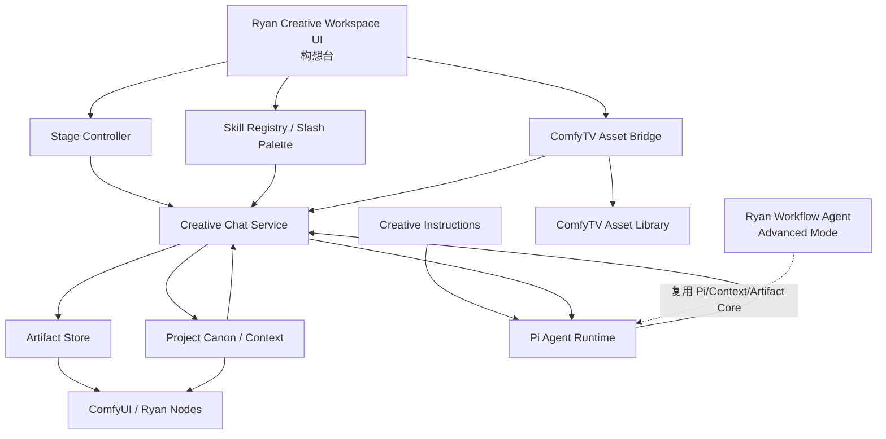
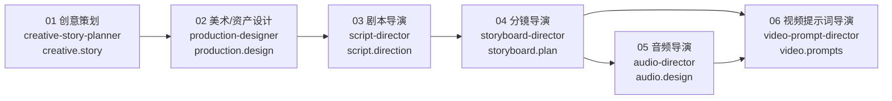
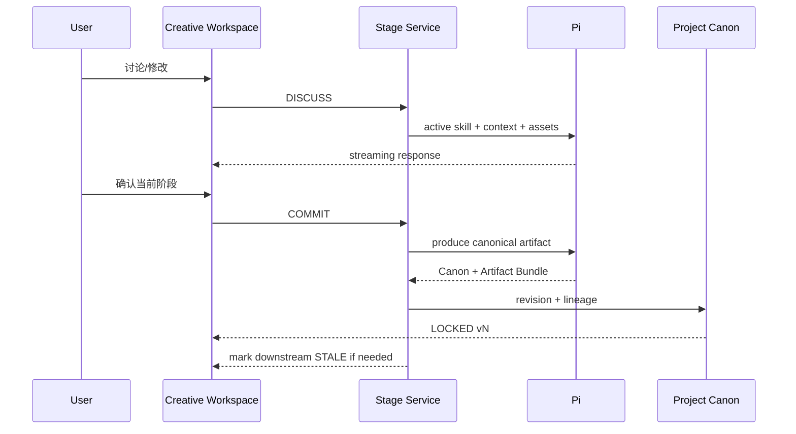

# Ryan Creative Workspace：构想台式 Agent 影视创作工作区详细设计

> **目标主工程：** `twj515895394/Ryan_Comfy_Utils`  
> **设计状态：** Architecture / Implementation Design v1  
> **日期：** 2026-08-16  
> **定位：** 在 `Ryan_Comfy_Utils` 内新增一个以 **Pi Agent + Skill + Project Canon + ComfyTV AssetRef** 为核心的影视创作工作区，用统一聊天式 Agent 交互串联“创意/剧本 → 角色与美术资产 → 分镜 → 音频/导演执行 → 视频提示词 → ComfyUI 生成节点”。  
> **重要边界：** 本设计的“构想台”**直接开发在 `Ryan_Comfy_Utils` 中**。TE_MAN 只作为交互范式参考；ComfyTV 只作为外部资产库与媒体能力提供者；二者都不是主工程。

---

## 0. 一句话结论

当前 `Ryan_Comfy_Utils` 已经具备 Pi RPC、Skill Contract、Chat / Commit、`RYAN_CONTEXT`、Artifact Bundle、附件、流式事件、Stop、Context Selector、Artifact Selector 等大量底层能力。

真正需要改变的，不是重新做一套 Agent Runtime，而是：

> **把“影视创作 = 一串 ComfyUI Workflow Agent 节点”的主交互方式，升级为“影视创作 = 一个 Project Workspace 中的多阶段 Agent 创作过程”。**

新的主产品关系应为：

```text
Ryan_Comfy_Utils
│
├── Ryan Creative Workspace     ← 新的主创作入口 / 构想台
│   ├── Pi Agent Runtime
│   ├── / Skill Palette
│   ├── 六阶段创作 Skill
│   ├── Project Canon
│   ├── Stage State / Version / Stale
│   ├── Artifact Store
│   └── ComfyTV Asset Bridge
│
├── Ryan Workflow Agent         ← 保留，降为高级 DAG / 自动化模式
│
├── Ryan Artifact Selector      ← 继续复用，消费 Creative Workspace 产物
│
└── 现有图片 / 视频 / Prompt / H3 等节点
```

外部关系：

```text
TE_MAN
  └── 只借鉴：构想台窗口、话题/状态、流式聊天、多附件、Skill UI 等交互范式

ComfyTV
  └── 只提供：Asset Library / Asset API / Media / Project 可选绑定

Ryan_Comfy_Utils
  └── 拥有：业务流程、Agent、Skill、Project Canon、Stage、Artifact、桥接逻辑
```

---

# 1. 为什么要从 Workflow Agent DAG 转向 Creative Workspace

## 1.1 当前 Workflow Agent 的设计本身并没有错

当前 Ryan Workflow Agent 的核心思想是：

```text
Workflow = Project Scope
Agent = 独立 Session
DAG = Context 传播路径
Chat != Commit
```

典型链路：

```text
Creative Agent
  → Production Agent
  → Script Agent
  → Storyboard Agent
  → Audio Agent
  → Video Prompt Agent
```

这套模型非常适合：

- 自动化流水线；
- 明确输入输出的任务；
- DAG fan-in / fan-out；
- 批处理；
- 高级用户自己设计 Agent 图；
- 无人值守执行。

但是影视创作本质不是单向 DAG，而是持续回跳、重写、比较、替换素材、重新确认的迭代过程。

真实创作更像：

```text
剧本 v3
   ↓
角色设计 v2
   ↓
分镜 v4
   ↓
发现人物动机不成立
   ↑
剧本 v4
   ↓
角色设计仍有效，但部分视觉状态需要检查
   ↓
分镜标记为 STALE
   ↓
重做部分 Shot
```

如果这些行为都通过 ComfyUI 节点连线表达，用户会被迫关心：

- 当前应该点哪个 Agent 节点；
- 哪条 `RYAN_CONTEXT` 线传播了什么；
- 修改上游后需要 Queue 哪些下游；
- Commit 是否已经进入下游；
- 某个 Agent 的私有 Chat 是否应该共享；
- fan-in 是否连接完整。

这些是系统应该管理的复杂度，不应该成为创作者的操作负担。

---

# 2. 新产品定位：Ryan Creative Workspace

建议产品名暂定：

- **Ryan Creative Workspace**
- UI 中文名可用：**Ryan 构想台 / 创作工作区**
- 内部模块名：`creative_workspace`

它不是一个“LLM Chat”。

它必须被定义成：

> **一个运行在 ComfyUI 内、由 Pi Agent 驱动、具有 Skill、工具、资产引用、阶段状态、项目 Canon 和正式产物管理能力的 Agent 创作 IDE。**

因此：

```text
普通 LLM Chat
= user message + model response

Ryan Creative Workspace
= user message
+ active skill
+ project canon
+ stage contract
+ asset refs
+ tool permissions
+ agent workspace
+ artifact output
+ stage state
+ version / dependency
```

---

# 3. 不可变架构决策

## ADR-001：唯一主工程是 Ryan_Comfy_Utils

所有新增核心逻辑放在：

```text
Ryan_Comfy_Utils/
└── ryan_comfy_utils/
```

包括：

- Creative Workspace 前端；
- Creative Project；
- Stage Controller；
- Slash Skill Palette；
- Creative Instructions；
- Pi Runtime Adapter；
- ComfyTV Asset Bridge；
- Project Canon；
- Artifact 管理；
- 新 API。

**禁止：**

- 把 Creative Workspace 主逻辑写进 ComfyTV；
- 让 ComfyTV 依赖 Ryan；
- 让 TE_MAN 成为运行时依赖；
- 在三个项目之间共享数据库对象。

---

## ADR-002：TE_MAN 只借鉴交互，不复制实现

TE_MAN 的“构想台”适合作为 UX Reference：

- 可拖拽/浮动面板；
- 多话题 / Session；
- Chat 消息流；
- 流式输出；
- Stop / Regenerate；
- 图片附件；
- 图片预览；
- Skill 状态；
- Starter Preset；
- 多 Topic 并发等。

但 Ryan 应：

- 自己实现；
- 沿用自己的 API、状态模型和组件；
- 不复制 TE_MAN 混淆 JS；
- 不依赖 TE_MAN。

原因除了架构解耦外，也包括 TE_MAN 当前 LICENSE 对复制、修改、衍生开发有明确限制。

---

## ADR-003：ComfyTV 是 Asset Provider，不是 Creative Workspace 宿主

ComfyTV 已有完整资产能力，因此 Ryan 不重做 Asset Library。

Ryan 新增：

```text
ComfyTVAssetBridge
```

只通过 API / AssetRef 使用 ComfyTV。

Ryan 保存的是引用，不保存第二份资产库。

---

## ADR-004：创作 Agent 与 Coding AGENTS 必须隔离

当前 Pi Runtime 已经使用：

```text
--no-context-files
```

这是正确方向，必须保留。

新的 Creative Workspace 不允许 Pi 自动读取：

- 仓库根 `AGENTS.md`；
- 用户目录中的全局 AGENTS；
- `CLAUDE.md`；
- Coding 项目规范；
- 其他隐式 Context File。

创作规则必须由 Ryan **显式注入**。

---

## ADR-005：V1 直接复用现有六个创作 Skill

现有目录：

```text
ryan_comfy_utils/acp/fixtures/skills/
├── creative-story-planner/
├── production-designer/
├── script-director/
├── storyboard-director/
├── audio-director/
└── video-prompt-director/
```

V1 不重新发明一套 Skill。

这些 Skill 已经具备 `agent-contract.json`，定义了：

- `display_name`
- `accepts_context_kinds`
- `produces_context_kind`
- `artifact_type`
- `artifact_output_kinds`
- `discussion_mode`
- `commit_mode`

Creative Workspace 应直接把这六个 Skill 升级为正式 Stage Skill Pack。

---

# 4. 总体架构



---

# 5. 四个平面

## 5.1 Creative Plane：人和 Agent 创作

负责：

- 对话；
- `/` 选择 Skill；
- 阶段切换；
- 图片/视频/音频/文档引用；
- Draft；
- 方案讨论；
- Retry / Stop；
- 阶段确认。

入口：

```text
Ryan Creative Workspace
```

---

## 5.2 Project Plane：项目事实与版本

负责：

- Project；
- Stage；
- Canon；
- Stage Revision；
- Dependency；
- STALE；
- Artifact；
- AssetRef；
- Continuity；
- Handoff。

它不负责运行模型。

---

## 5.3 Agent Plane：Pi + Skill

负责：

- Pi RPC；
- 当前 Skill；
- Tools；
- Creative Instructions；
- Context 编译；
- Asset Context 编译；
- Streaming Events；
- Stop；
- Agent Turn。

---

## 5.4 Execution Plane：ComfyUI 节点生成

负责：

- 生图；
- 图像编辑；
- 视频；
- H3；
- 音频；
- 现有 Ryan Node；
- ComfyTV 工作流 / Stage；
- 最终 Queue。

Creative Workspace **不自动替代 ComfyUI**。

它输出：

```text
Prompt
AssetRef
Artifact
Params
```

供节点执行。

---

# 6. Creative Project 不再等于 ComfyUI Workflow

这是本次设计中一个重要升级。

旧模式：

```text
workflow_id = project boundary
```

Creative Workspace 不应继续被某一张 ComfyUI Workflow 图限制。

建议新增：

```text
creative_project_id
```

关系：

```text
Creative Project
├── 可以使用多个 ComfyUI Workflow
├── 可以引用一个或多个 ComfyTV Assets
├── 可以长期存在多个 Stage Session
└── 不因画布换 Workflow 而丢失
```

旧的：

```text
workflow_id + agent_uid
```

继续属于 `Ryan Workflow Agent` 高级模式。

新的：

```text
creative_project_id + stage_id + thread_id
```

属于 Creative Workspace。

---

# 7. V1 六阶段正式流程



注意：

> UI 展示的是“创作阶段”，底层绑定现有 Skill；用户不需要理解 ComfyUI Agent Node。

---

# 8. 六个现有 Skill 的正式映射

| Stage | Skill | 输入 Context | 输出 | Artifact |
|---|---|---|---|---|
| 创意策划 | `creative-story-planner` | `*` | `creative.story` | `concept_image_prompt` |
| 美术/资产设计 | `production-designer` | creative / character / location / research | `production.design` | `image_prompt` |
| 剧本导演 | `script-director` | creative + production | `script.direction` | 默认无 Prompt Artifact |
| 分镜导演 | `storyboard-director` | creative + production + script | `storyboard.plan` | storyboard / keyframe prompt |
| 音频导演 | `audio-director` | creative + production + script + storyboard | `audio.design` | audio prompt |
| 视频提示词导演 | `video-prompt-director` | storyboard + script + production + creative + audio | `video.prompts` | video prompt |

---

# 9. “导演阶段”如何处理

用户实际需求中存在一个非常明确的“导演”概念：

- 人物表演；
- blocking；
- gaze；
- movement；
- camera；
- timing；
- environment motion；
- continuity。

当前六 Skill 中这些能力分散于：

- `script-director`
- `storyboard-director`
- `video-prompt-director`

因此 V1 **不新增第七个 Skill**，先复用现有六个，避免重构过大。

但 Stage / Artifact Schema 必须预留：

```text
cinematic.direction
```

V2 如果发现“分镜 → 视频 Prompt”之间的导演决策过重，可以无破坏性增加：

```text
cinematic-director/
```

插入：

```text
storyboard.plan
   ↓
cinematic.direction
   ↓
video.prompts
```

---

# 10. `/` Skill Palette：Agent 工作区的核心交互

这是 Creative Workspace 与普通 LLM Chat 的关键区别。

## 10.1 用户体验

输入框中键入：

```text
/
```

立即弹出 Skill Palette：

```text
┌──────────────────────────────────────┐
│ 选择 Agent Skill                    │
│                                      │
│ 当前阶段                             │
│ ✓ 剧本导演            script-director│
│                                      │
│ 创作主链                             │
│   创意策划            creative...    │
│   美术/资产设计       production...  │
│   分镜导演            storyboard...  │
│   音频导演            audio...       │
│   视频提示词导演      video...       │
│                                      │
│ 工具型 Skill                         │
│   图像提示词生成                     │
│   图片反推                           │
│   MiniMax H3 Prompt                  │
└──────────────────────────────────────┘
```

支持：

- `/` 打开；
- 输入 `/story`、`/分镜` 模糊过滤；
- ↑↓ 键选择；
- Enter 确认；
- Esc 关闭；
- 鼠标选择；
- Skill 描述预览；
- 显示当前 Stage 推荐 Skill；
- 显示是否是 Stage Skill / Utility Skill。

---

## 10.2 不要把 `/xxx` 原样发给模型

前端应把它解析成结构化 Invocation：

```json
{
  "skill_id": "storyboard-director",
  "invocation_scope": "stage",
  "user_message": "把第二场拆成6个镜头"
}
```

Pi 实际运行时仍由 Ryan 构造：

```text
pi --mode rpc
   --no-context-files
   --skill <skill-directory>
   --system-prompt <creative-system-prompt>
```

这样可以得到与 Pi CLI `/skill` 类似的体验，但控制权在 Ryan。

---

## 10.3 Stage Skill 与 Utility Skill 分开

### Stage Skill

六个正式创作 Skill。

选择后：

```text
当前 Stage → 对应 Stage
Active Skill → 对应 Skill
Context Selector → 按 Stage Contract 重新构建
```

例如：

```text
/storyboard-director
```

等价于：

```text
切换到「分镜导演」
```

---

### Utility Skill

例如现有：

- `image_prompt_generator`
- `image_prompt_reverse`
- `image-edit-prompt-architect-zh`
- `minimax-h3-video-prompt`
- `video_prompt_generator`

这类 Skill 默认：

```text
invocation_scope = one_turn
```

只服务当前一轮，不改变项目 Stage Canon。

例如：

```text
当前：美术/资产设计

用户：
/image_prompt_reverse
参考这张图片分析一下它的视觉风格
```

结果可以作为 Draft / Reference Note，而不是自动成为 `production.design` Canon。

---

## 10.4 Skill Invocation Model

建议：

```json
{
  "skill_id": "image_prompt_reverse",
  "scope": "turn",
  "stage_id": "production",
  "promote_result": false
}
```

而主阶段：

```json
{
  "skill_id": "production-designer",
  "scope": "stage",
  "stage_id": "production",
  "promote_result": true
}
```

---

# 11. Skill Registry

现有：

```text
GET /ryan/agent/skills
```

已经扫描 Skill 目录并读取 `agent-contract.json`。

Creative Workspace 不重新做 Skill Loader。

建议新增包装 API：

```text
GET /ryan/creative/skills
```

内部复用现有 `list_skills()`，额外增加：

```json
{
  "skill_id": "storyboard-director",
  "group": "stage",
  "stage_id": "storyboard",
  "order": 40,
  "slash_aliases": [
    "storyboard",
    "分镜",
    "分镜导演"
  ]
}
```

这些 Creative UI 元数据建议写在：

```text
creative_workspace/stage_registry.py
```

而不是污染原有 Skill Contract。

---

# 12. 输入 Composer 设计

现有 `workflow_agent/composer.js` 已有：

- Enter 发送；
- Shift+Enter 换行；
- Stop；
- Draft；
- 自动高度。

建议抽象为共享 Agent Composer，并增加：

```text
[+] [@资产] [/ Skill] [当前技能]
┌───────────────────────────────────┐
│ 描述你的要求，输入 / 选择技能... │
└───────────────────────────────────┘
          [发送 / Stop]
```

交互能力：

- `/` → Skill Palette；
- `@` → Asset Picker；
- Ctrl+V → 图片附件；
- Drag & Drop → Asset / Local File；
- 消息发送；
- Stop；
- Retry；
- 当前 Skill Chip；
- 当前 Stage Chip。

---

# 13. UI 总体布局

建议保留 TE_MAN 构想台的“轻量、可拖动、面板化”体验，但结合 Ryan 的 Stage 概念。

```text
┌─────────────────────────────────────────────────────────┐
│ Ryan Creative Workspace     项目：雨夜     [浮动][关闭] │
├──────────────────┬──────────────────────────────────────┤
│ 项目阶段          │ 当前：分镜导演              v4      │
│                  │                                      │
│ ● 01 创意策划 ✓  │ Skill: storyboard-director          │
│ ● 02 美术设计 ✓  │ Context: 3 Canon / 8 Assets         │
│ ● 03 剧本导演 ✓  │                                      │
│ ● 04 分镜导演 ●  │ ──────────────────────────────────  │
│ ○ 05 音频导演    │                                      │
│ ○ 06 视频Prompt  │ User / Agent Message Stream          │
│                  │                                      │
│ 临时讨论          │ [图片卡片] [视频卡片] [Artifact]     │
│ + 新建话题        │                                      │
│                  │ ──────────────────────────────────  │
│ 项目资产          │ [@资产] [/Skill]                    │
│ 项目 Canon        │ 输入框                               │
│ 历史版本          │                       [发送/Stop]    │
└──────────────────┴──────────────────────────────────────┘
```

---

# 14. “阶段”与“话题”必须是两种不同概念

不要完全照搬 TE_MAN Topic。

Creative Workspace 应区分：

## Stage

正式创作主链：

```text
creative
production
script
storyboard
audio
video_prompt
```

每个 Stage：

- 有默认 Skill；
- 有 Canon；
- 有 Revision；
- 有状态；
- 有 Dependency。

---

## Thread / Topic

Stage 内可以有多个临时讨论：

```text
分镜导演
├── 主讨论
├── 第二场重做方案
├── 运镜测试
└── 参考片分析
```

Thread 不自动成为 Canon。

这样既保留 TE_MAN “话题自由度”，又不破坏正式生产流程。

---

# 15. Stage 状态机

建议：

```text
NOT_STARTED
DRAFT
READY
LOCKED
STALE
ERROR
```

含义：

| 状态 | 说明 |
|---|---|
| NOT_STARTED | 从未进入 |
| DRAFT | 正在讨论，有未确认内容 |
| READY | Agent 已生成可确认 Draft |
| LOCKED | 用户确认当前 Revision 为 Canon |
| STALE | 上游 Canon 已更新，本阶段可能过期 |
| ERROR | 当前 Agent Turn / Commit 失败 |

---

# 16. STALE 是替代 DAG 重跑的关键机制

例如：

```text
creative.story v3       LOCKED
production.design v2    LOCKED
script.direction v4     LOCKED
storyboard.plan v5      LOCKED
video.prompts v2        LOCKED
```

用户把：

```text
script.direction v4
```

改成：

```text
script.direction v5
```

系统不删除下游结果，而是：

```text
storyboard.plan v5    → STALE
audio.design v2       → STALE
video.prompts v2      → STALE
```

用户可以：

- 保持旧版本；
- 检查差异；
- 局部更新；
- 全量重新确认。

这是创作工作区比 DAG 更自然的地方。

---

# 17. Project Canon

Project Canon 是整个 Creative Workspace 的“正式事实层”。

Chat History 不是 Canon。

建议数据：

```json
{
  "project_id": "creative_01...",
  "entries": [
    {
      "entry_id": "entry_01...",
      "kind": "script.direction",
      "stage_id": "script",
      "revision": 5,
      "status": "active",
      "content": "...",
      "asset_refs": [],
      "upstream_entry_ids": [],
      "created_at": "..."
    }
  ]
}
```

最大程度兼容现有 `RyanContext / Entry / lineage`。

---

# 18. 保留 Chat != Commit，但修改用户术语

底层仍然保留：

```text
DISCUSS
COMMIT
```

因为这个思想非常正确。

UI 不应显示工程术语 Commit。

推荐：

```text
DISCUSS → 正常聊天 / 草稿讨论
COMMIT  → 确认当前阶段 / 锁定版本
```

按钮：

```text
[确认当前阶段]
```

而不是：

```text
[Commit]
```

---

# 19. 正式确认流程



---

# 20. Creative Instructions：隔离 Coding AGENTS

建议目录：

```text
ryan_comfy_utils/
└── creative_workspace/
    ├── instructions/
    │   ├── AGENTS.md
    │   ├── continuity.md
    │   ├── asset_rules.md
    │   └── artifact_rules.md
    │
    └── ...
```

注意：

这里的 `AGENTS.md` **不是让 Pi 自动扫描**。

加载方式必须是：

```python
CreativeInstructionProvider
    -> read internal AGENTS.md
    -> compose system prompt
    -> PiRpcRunner(--system-prompt)
```

同时继续：

```text
--no-context-files
```

因此：

```text
Ryan_Comfy_Utils/AGENTS.md
```

仍然只约束 Coding Agent / 开发工作，不进入影视创作。

---

# 21. System Prompt Composition

建议：

```text
[RYAN_CREATIVE_BASE]
你是 Ryan Creative Workspace 中的创作 Agent...

[CREATIVE_WORKSPACE_RULES]
<creative_workspace/instructions/AGENTS.md>

[STAGE_CONTRACT]
当前 Stage / produces / accepts / artifact rules

[ACTIVE_SKILL]
通过 --skill 由 Pi 加载

[PROJECT_CONTEXT]
Project Canon selector 编译结果

[ASSET_CONTEXT]
当前引用资产

[USER_MESSAGE]
...
```

不要：

- 自动读取整个 Repo；
- 自动读取 Coding docs；
- 把所有六个 Skill 全部塞进 System Prompt；
- 把全部历史 Canon 每轮全量注入。

---

# 22. Pi Runtime

现有：

```text
ryan_comfy_utils/workflow_agent/pi_rpc.py
```

已经具备：

- `--mode rpc`
- `--no-context-files`
- `--no-session`
- `--approve`
- `--skill`
- `--system-prompt`
- Tool Policy
- JSONL Event Parse
- Stop
- timeout
- per-request process

这些能力应该直接复用。

V1 不重新做 Agent Runner。

---

# 23. Agent Runtime 与 LLM 模式的边界

Creative Workspace V1 建议：

> **不提供 TE_MAN 那种 OpenAI / Gemini / Claude 普通 LLM Provider Chat UI。**

主入口只走：

```text
Pi Agent
```

也就是说产品明确：

```text
不是：
Provider = OpenAI / Gemini / Claude
Model = xxx
普通聊天

而是：
Agent Runtime = Pi
Skill = xxx
Tools = allowed set
Workspace = Creative Project
```

Pi 内部具体使用什么 Provider / Model，是 Pi Runtime 配置问题，不把构想台设计退化为普通 LLM Chat。

---

# 24. 多 Agent 并发

TE_MAN 的一个值得借鉴的点是不同 Topic 可以同时生成。

Creative Workspace 后端建议活动请求主键：

```text
project_id + thread_id
```

而不是全局唯一 generating。

即：

```text
Story Thread A       → generating
Storyboard Thread B  → generating
Video Prompt Thread  → generating
```

可以并行。

同一个 Stage Canon 的 COMMIT 操作需要加锁：

```text
project_id + stage_id
```

避免两个确认请求同时创建相同 revision。

---

# 25. ComfyTV Asset Bridge

这是新系统里非常重要的一层。

新增：

```text
ryan_comfy_utils/creative_workspace/asset_bridge.py
```

职责：

```text
ComfyTV Asset ID
    ↓
读取 Asset Metadata
    ↓
解析 media_type / payload_url
    ↓
按需要解析本地路径
    ↓
创建 Ryan ExternalAssetRef
    ↓
按媒体类型生成 Agent Context
```

---

# 26. 为什么不继续复制资产进 Agent Session

当前 Workflow Agent `assets.py` 是 Session Asset Store：

```text
外部文件
  ↓
copyfile
  ↓
agent scope/assets
```

并有单文件大小限制。

这对于“上传一张参考图”可以接受。

但直接引用 ComfyTV 中的大视频时不适合：

```text
同一个 500 MB 视频
  × 剧本 Stage
  × 分镜 Stage
  × 视频 Prompt Stage
```

不应该产生多个副本。

Creative Workspace 对 ComfyTV 资产采用：

```text
Reference-first
Lazy Materialization
```

---

# 27. Creative AssetRef Schema

建议：

```json
{
  "asset_ref_id": "ref_01...",
  "provider": "comfytv",
  "provider_asset_id": 328,
  "media_type": "video",
  "display_name": "雨夜街道参考.mp4",
  "semantic_role": "camera_motion_reference",
  "target_ids": ["SHOT_003"],
  "usage": "reference",
  "metadata_snapshot": {
    "mime_type": "video/mp4",
    "width": 1920,
    "height": 1080
  }
}
```

不要在 Project Canon 中保存：

- base64；
- 大文件；
- ComfyTV 数据库对象；
- 重复二进制。

---

# 28. `@资产` 交互

输入：

```text
@
```

或点击：

```text
[@资产]
```

打开 Asset Picker。

建议直接使用 ComfyTV Asset API，而不是重新扫描文件。

```text
┌──────────────────────────────────────┐
│ ComfyTV Assets                       │
│ 搜索：女主                           │
│                                      │
│ [全部] [图片] [视频] [音频]          │
│                                      │
│ ☑ 女主定妆.jpg                       │
│ ☑ 雨夜推进.mov                       │
│                                      │
│ 作为：                               │
│ [角色身份参考 ▼]                     │
│                                      │
│ [引用选中资产]                       │
└──────────────────────────────────────┘
```

---

# 29. Asset Semantic Role

这是比“附件”更重要的设计。

同一张图片可能是：

```text
character_identity
costume_reference
style_reference
composition_reference
location_reference
prop_reference
```

同一段视频可能是：

```text
camera_motion_reference
performance_reference
edit_rhythm_reference
visual_style_reference
scene_reference
```

所以 AssetRef 必须允许附加：

```text
semantic_role
target_ids
usage
```

Agent 才知道“为什么看这个素材”。

---

# 30. 图片 / 视频 / 音频 Agent Adapter

统一接口：

```python
class MediaContextAdapter:
    supports(asset_ref) -> bool
    compile(asset_ref, agent_capabilities) -> AssetContext
```

---

## 30.1 Image Adapter

优先级：

```text
1. Agent Runtime 支持原生视觉输入
2. 将本地路径作为可访问附件
3. 使用视觉分析 Adapter 生成结构化描述
```

输出：

```text
asset metadata
+ semantic role
+ target ids
+ image context
```

---

## 30.2 Video Adapter

不把整段视频文本化后硬塞模型。

建议：

```text
video
├── metadata
├── duration
├── fps
├── keyframes
├── scene frames（按需）
├── transcript（按需）
└── semantic role
```

当前 Ryan 已经有从视频提取：

```text
首帧 / 中帧 / 尾帧
```

的逻辑，可以复用，但 Creative Workspace 对 ComfyTV 视频不先复制原视频。

---

## 30.3 Audio Adapter

ComfyTV 原生资产模型支持 audio，因此 Creative Workspace 应正式支持。

建议上下文：

```text
duration
codec
transcript（按需）
speaker / music / ambience metadata
semantic role
```

不要继续沿用旧 Workflow AssetStore 中“audio disabled”的限制到 Creative Workspace。

---

# 31. ComfyTV Asset API 使用方式

Ryan 只调用：

```text
GET /comfytv/assets
GET /comfytv/asset_categories
```

以及必要的资产创建 / 更新 API。

V1 最重要的是读取。

ComfyTV Asset 已包含：

```text
id
category_ids
name
media_type
payload_url
mime_type
width
height
size_bytes
source
metadata
```

这已经足够做 External Asset Provider。

---

# 32. ComfyTV Project 的关系

ComfyTV 有自己的 Project API。

建议：

```json
{
  "creative_project_id": "creative_xxx",
  "external_bindings": {
    "comfytv_project_id": "optional"
  }
}
```

但不要：

```text
Creative Project == ComfyTV Project DB Row
```

理由：

- 两个插件生命周期独立；
- Ryan 是主业务；
- ComfyTV 可选安装；
- Creative Project 未来还可能引用其他 Asset Provider。

---

# 33. ComfyTV 不可用时的降级

必须保证：

```text
没有 ComfyTV
≠ Creative Workspace 不能用
```

降级：

```text
Local Upload
   ↓
Ryan Session / Project Asset
```

有 ComfyTV 时：

```text
@资产
   ↓
ComfyTV Asset Bridge
```

所以 Asset Provider 接口：

```python
AssetProvider
├── ComfyTVAssetProvider
└── LocalAssetProvider
```

---

# 34. Artifact 设计：尽量保持现有合同

当前 Ryan 已经有成熟 Artifact Bundle：

```text
concept_image_prompt
image_prompt
storyboard_prompt
keyframe_prompt
audio_prompt
video_prompt
```

Creative Workspace 不应该发明第二套 Artifact Schema。

正式 Stage Commit 继续产生：

```text
Canonical Markdown
+
ryan-artifact Bundle
```

这样现有：

```text
Ryan Artifact Selector
```

可以继续消费。

---

# 35. Creative Workspace → ComfyUI 节点

提供三种方式。

## 方式 A：现有 Ryan Artifact Selector

最低风险。

```text
Creative Project Context
        ↓
Ryan Artifact Selector
        ↓
Prompt STRING
        ↓
H3 / Image / Video Node
```

---

## 方式 B：Creative Artifact Node

后续可新增：

```text
Ryan Creative Artifact
```

参数：

```text
Project
Stage
Artifact Type
Target
Revision
```

---

## 方式 C：UI 直接发送到选中节点

Artifact 卡片：

```text
SEG_003 / video_prompt

[复制]
[发送到选中节点]
[创建 H3 节点]
```

这是体验最好的后续能力。

---

# 36. Artifact 与模型 Adapter

视频创作建议明确分层：

```text
video-prompt-director
       ↓
model-neutral video prompt
       ↓
Model Adapter
       ├── MiniMax H3
       ├── Seedance
       ├── Veo
       └── Kling
```

现有：

```text
minimax-h3-video-prompt
```

可以作为 Utility / Adapter Skill。

这样更换视频模型不会要求重新做 Story / Character / Storyboard。

---

# 37. 前端代码结构

主工程仍是 Ryan。

建议：

```text
ryan_comfy_utils/web/
├── ryan_creative_workspace.js
│
├── creative_workspace/
│   ├── index.js
│   ├── workspace_panel.js
│   ├── workspace_state.js
│   ├── stage_sidebar.js
│   ├── stage_header.js
│   ├── thread_list.js
│   ├── message_list.js
│   ├── composer.js
│   ├── skill_palette.js
│   ├── asset_picker.js
│   ├── attachment_tray.js
│   ├── artifact_panel.js
│   ├── canon_viewer.js
│   ├── version_panel.js
│   ├── api_client.js
│   └── styles.js
│
└── workflow_agent/
    └── ... existing
```

由于 ComfyUI 只保证扫描 web 根目录，入口保持和现有：

```text
ryan_workflow_agent.js
  -> import ./workflow_agent/index.js
```

相同模式：

```text
ryan_creative_workspace.js
  -> import ./creative_workspace/index.js
```

---

# 38. 不要立即复制现有 workflow_agent 前端组件

当前已经有：

```text
agent_panel.js
api_client.js
artifact_selector_extension.js
attachment_tray.js
commit_bar.js
composer.js
context_inspector.js
message_list.js
panel_manager.js
state_store.js
styles.js
```

V1 优先：

```text
import / reuse
```

如果复用出现耦合，再抽：

```text
web/agent_ui/
```

共享：

```text
Composer
MessageList
AttachmentTray
StreamingMessage
StopButton
ImagePreview
```

避免维护两套 Chat UI。

---

# 39. 后端建议目录

不要把全部 Creative 逻辑继续塞进 `workflow_agent/`。

建议新增：

```text
ryan_comfy_utils/
├── creative_workspace/
│   ├── __init__.py
│   ├── models.py
│   ├── project_repository.py
│   ├── stage_registry.py
│   ├── stage_service.py
│   ├── thread_service.py
│   ├── skill_registry.py
│   ├── instruction_provider.py
│   ├── context_compiler.py
│   ├── asset_bridge.py
│   ├── media_adapters.py
│   ├── artifact_service.py
│   ├── dependency_service.py
│   └── routes.py
│
├── workflow_agent/
│   ├── pi_rpc.py
│   ├── models.py
│   ├── artifacts.py
│   ├── context_select.py
│   ├── skill_contract.py
│   └── ...
```

---

# 40. V1 的复用策略：先 import，不大重构

为了降低风险，V1 可以直接复用：

```python
from ryan_comfy_utils.workflow_agent.pi_rpc import PiRpcRunner
from ryan_comfy_utils.workflow_agent.models import RyanContext
from ryan_comfy_utils.workflow_agent.skill_contract import load_skill_contract
```

以及现有 Artifact Parser / Validator。

等 Creative Workspace 稳定后再考虑把共用能力提取成：

```text
agent_core/
```

不要第一阶段就大规模移动已有文件。

---

# 41. Creative Project 存储结构

建议：

```text
output/ryan_creative_workspace/
└── projects/
    └── <project_id>/
        ├── project.json
        ├── state.json
        │
        ├── canon/
        │   ├── creative/
        │   ├── production/
        │   ├── script/
        │   ├── storyboard/
        │   ├── audio/
        │   └── video_prompt/
        │
        ├── threads/
        │   ├── <thread_id>.jsonl
        │   └── ...
        │
        ├── artifacts/
        │
        ├── refs/
        │   └── assets.json
        │
        └── cache/
            ├── video_frames/
            ├── transcripts/
            └── previews/
```

注意：

```text
refs/
```

只存 AssetRef。

ComfyTV 原始媒体仍然在 ComfyTV 管理。

---

# 42. Project JSON

```json
{
  "schema_version": 1,
  "project_id": "creative_01...",
  "name": "雨夜",
  "pipeline_id": "cinematic_v1",
  "current_stage": "storyboard",
  "created_at": "...",
  "updated_at": "...",
  "external_bindings": {
    "comfytv_project_id": null
  }
}
```

---

# 43. Stage State

```json
{
  "stage_id": "storyboard",
  "skill_id": "storyboard-director",
  "status": "LOCKED",
  "revision": 5,
  "latest_entry_id": "entry_xxx",
  "depends_on": [
    "creative",
    "production",
    "script"
  ],
  "stale_causes": []
}
```

---

# 44. Dependency Graph

不用让用户画 DAG。

系统根据 Pipeline 定义维护：

```yaml
creative:
  depends_on: []

production:
  depends_on:
    - creative

script:
  depends_on:
    - creative
    - production

storyboard:
  depends_on:
    - creative
    - production
    - script

audio:
  depends_on:
    - script
    - storyboard

video_prompt:
  depends_on:
    - creative
    - production
    - script
    - storyboard
    - audio
```

这本质上仍然是 DAG。

区别是：

> **DAG 从用户操作界面下沉到程序内部。**

这是整次架构改造的核心。

---

# 45. Pipeline 配置

建议固定模板：

```text
ryan_comfy_utils/creative_workspace/pipelines/cinematic_v1.yaml
```

示意：

```yaml
id: cinematic_v1
display_name: AI影视创作

stages:
  - id: creative
    skill: creative-story-planner

  - id: production
    skill: production-designer

  - id: script
    skill: script-director

  - id: storyboard
    skill: storyboard-director

  - id: audio
    skill: audio-director
    optional: true

  - id: video_prompt
    skill: video-prompt-director
```

---

# 46. 固定工作区不等于硬编码流程

V1 默认固定：

```text
cinematic_v1
```

但底层仍然配置化。

未来：

```text
short_drama_v1
commercial_v1
mv_v1
video_rewrite_v1
comic_drama_v1
```

都可以使用相同 Workspace UI。

---

# 47. API 设计

建议统一新前缀：

```text
/ryan/creative/*
```

---

## 47.1 Project

```text
GET    /ryan/creative/projects
POST   /ryan/creative/projects
GET    /ryan/creative/projects/{project_id}
PATCH  /ryan/creative/projects/{project_id}
DELETE /ryan/creative/projects/{project_id}
```

---

## 47.2 Stage

```text
GET  /ryan/creative/projects/{project_id}/stages
GET  /ryan/creative/projects/{project_id}/stages/{stage_id}
POST /ryan/creative/projects/{project_id}/stages/{stage_id}/confirm
POST /ryan/creative/projects/{project_id}/stages/{stage_id}/reopen
```

---

## 47.3 Chat

```text
POST /ryan/creative/chat
POST /ryan/creative/chat/stop
```

请求：

```json
{
  "project_id": "...",
  "stage_id": "storyboard",
  "thread_id": "...",
  "skill_id": "storyboard-director",
  "skill_scope": "stage",
  "message": "...",
  "asset_refs": []
}
```

---

## 47.4 Skill

```text
GET /ryan/creative/skills
```

数据来源：

```text
现有 /ryan/agent/skills
+
Creative Stage Registry
```

---

## 47.5 Canon

```text
GET /ryan/creative/projects/{project_id}/canon
GET /ryan/creative/projects/{project_id}/canon/{kind}
GET /ryan/creative/projects/{project_id}/history
```

---

## 47.6 Asset Bridge

```text
GET  /ryan/creative/assets/providers
GET  /ryan/creative/assets?provider=comfytv
POST /ryan/creative/projects/{project_id}/asset-refs
DELETE /ryan/creative/projects/{project_id}/asset-refs/{ref_id}
```

---

## 47.7 Artifact

```text
GET /ryan/creative/projects/{project_id}/artifacts
GET /ryan/creative/projects/{project_id}/artifacts/{artifact_id}
```

---

# 48. Streaming Event Contract

尽量沿用现有 Ryan Agent Event。

建议统一：

```json
{
  "type": "delta",
  "project_id": "...",
  "stage_id": "...",
  "thread_id": "...",
  "request_id": "...",
  "text": "..."
}
```

事件：

```text
status
started
delta
tool
completed
stopped
error
```

Creative Workspace UI 不需要知道 Pi 原始 JSONL 格式。

---

# 49. Context Compiler

输入：

```text
Current Stage
+
accepts_context_kinds
+
latest active Canon
+
AssetRefs
+
Current Thread Draft
+
User Message
```

输出：

```text
Pi Prompt Context
```

必须遵守：

1. 只选择当前 Skill 相关 `kind`；
2. 每个 `stage/kind` 默认最新 active revision；
3. 不自动注入所有 Chat History；
4. 不自动注入旧废弃 Canon；
5. Asset 只注入 Reference Context；
6. 超大文档按 summary / on-demand 策略。

---

# 50. Token / Context 控制

随着项目增长，必须避免全量上下文。

建议优先级：

```text
P0 当前用户消息
P1 当前 Stage 最新 Canon
P2 当前 Stage 直接依赖 Canon
P3 当前引用 Asset Context
P4 Project Lock / Continuity
P5 更早上游摘要
```

旧 Revision 默认不进模型。

---

# 51. 版本与差异

Stage Revision：

```text
script v4 → script v5
```

至少记录：

```text
revision
entry_id
created_at
upstream_entry_ids
asset_ref_ids
```

V2 可增加：

```text
diff summary
```

让用户看到：

```text
剧本 v5 相比 v4：
- SCN_003 对白修改
- CHAR_001 动机变化
- 结尾节奏提前 4 秒
```

---

# 52. UI 中的 Canon Viewer

左侧或 Header：

```text
[查看当前 Canon]
```

打开：

```text
Creative Story Canon
Production Design Canon
Script Direction Canon
Storyboard Canon
Audio Design Canon
Video Prompt Canon
```

不要让用户去文件系统找 Markdown。

---

# 53. Artifact Card

Agent 消息中识别 Artifact：

```text
┌─────────────────────────────────────┐
│ 🎬 SEG_003 视频提示词               │
│ video_prompt · segment_execution    │
│                                     │
│ 一个年轻女人缓慢走向窗边……         │
│                                     │
│ [复制] [发送到节点] [查看来源]       │
└─────────────────────────────────────┘
```

来源：

```text
video.prompts v3
← storyboard.plan v5
← script.direction v4
```

---

# 54. UI 中明确展示 Agent 而不是 Model

顶部不重点展示：

```text
GPT / Claude / Gemini
```

而展示：

```text
Agent: 分镜导演
Skill: storyboard-director
Stage: 分镜
Context: Script v4 / Production v2
```

Provider / Model 放在高级设置中即可。

这能强化：

> **这是 Agent Workspace，不是 LLM Playground。**

---

# 55. Starter Preset

借鉴 TE_MAN Starter Preset，但改成影视工作入口：

```text
从零创作故事
改写现有剧本
根据参考视频二创
设计角色视觉
把剧本拆成分镜
生成视频 Prompt
```

Starter Preset 的作用：

- 创建 Project；
- 选择起始 Stage；
- 注入一个 hidden user intent；
- 不应该伪造 Canon。

---

# 56. 临时 Skill 结果与正式 Canon 的边界

必须清楚：

```text
/image_prompt_reverse
```

结果只是：

```text
Reference / Draft
```

不是：

```text
production.design Canon
```

除非用户：

```text
[合并到当前阶段]
```

或让当前 Stage Agent 消化后再 `确认当前阶段`。

---

# 57. Workflow Agent 的新定位

现有 `Ryan Workflow Agent` 不删除。

未来产品定位：

```text
Ryan Creative Workspace
= 默认影视创作体验

Ryan Workflow Agent
= Advanced Automation / DAG Agent
```

适用 Workflow Agent：

- 高级自动编排；
- 批量无人值守；
- 自定义 Agent DAG；
- fan-out / fan-in 实验；
- 程序化 Pipeline。

---

# 58. Creative Workspace 与 Workflow Agent 共用什么

共用：

```text
PiRpcRunner
Skill Loader
Skill Contract
Ryan Context Models
Artifact Schema
Artifact Parser / Validator
Event Parse
Stop / Timeout
部分 Agent UI
```

不共用：

```text
Project identity
Stage state
Thread model
ComfyTV bridge
Creative Instructions
Stage dependency
STALE
Creative UI
```

---

# 59. 测试策略

## Backend Unit

至少覆盖：

- Creative Project CRUD；
- Stage Registry；
- Skill mapping；
- stage confirm revision；
- downstream stale；
- Context selection；
- utility skill 不污染 Canon；
- ComfyTV ref；
- provider unavailable fallback；
- concurrent stage commit lock；
- Pi stop；
- invalid artifact；
- AGENTS isolation。

---

## Frontend Unit

覆盖：

- `/` 打开 Skill Palette；
- fuzzy filter；
- keyboard navigation；
- Enter select；
- Esc close；
- Stage Skill 切换；
- Utility Skill one-turn；
- `@资产`；
- streaming；
- Stop；
- Stage status；
- Stale warning。

---

## E2E

最小完整链：

```text
Create Project
→ Creative Discuss
→ Confirm
→ Production
→ @ ComfyTV Image
→ Confirm
→ Script
→ Storyboard
→ Confirm
→ Video Prompt
→ Confirm
→ Ryan Artifact Selector
→ Video Node
```

---

# 60. 开发阶段

## Phase 0：冻结现有 Workflow Agent

目标：

- 不继续往 DAG UI 增加影视业务特性；
- 只修 bug；
- 将影视主体验转向 Creative Workspace。

---

## Phase 1：Creative Workspace Shell

实现：

- 新 root entry；
- 面板；
- Project；
- Stage Sidebar；
- Message List；
- Composer；
- Pi Chat；
- Stop；
- 六阶段显示。

暂时不做复杂 Canon Dependency。

---

## Phase 2：`/` Skill Palette

实现：

- `GET /ryan/creative/skills`；
- Slash detection；
- Skill Palette；
- Stage Skill；
- Utility Skill；
- keyboard interaction；
- active skill chip。

这是第一个必须完成的 Agent 化特征。

---

## Phase 3：Project Canon / Confirm

实现：

- Stage Canon；
- Revision；
- Confirm；
- LOCKED；
- Context Selector；
- Canon Viewer。

---

## Phase 4：Dependency / STALE

实现：

- Pipeline dependency；
- upstream revision snapshot；
- downstream stale；
- UI warning；
- revalidate。

---

## Phase 5：ComfyTV Asset Bridge

实现：

- detect ComfyTV；
- list assets；
- Asset Picker；
- `@资产`；
- AssetRef；
- semantic role；
- image context。

---

## Phase 6：Video / Audio Media Adapter

实现：

- video metadata；
- keyframes；
- cache；
- transcript interface；
- audio metadata / transcript；
- Lazy Materialization。

---

## Phase 7：Artifact → ComfyUI

实现：

- 复用 Artifact Bundle；
- Creative Artifact API；
- Artifact Selector integration；
- UI send-to-selected-node。

---

## Phase 8：UX Polish

实现：

- floating / docked；
- resize；
- topic/thread；
- image preview；
- video preview；
- regenerate；
- multi-thread generation；
- keyboard shortcuts；
- project templates。

---

# 61. V1 MVP 验收标准

必须满足：

1. Creative Workspace 位于 `Ryan_Comfy_Utils`。
2. 不依赖 TE_MAN 安装。
3. ComfyTV 缺失时仍能启动。
4. Pi 是主 Agent Runtime。
5. `--no-context-files` 保留。
6. Coding `AGENTS.md` 不进入 Creative Agent。
7. Creative Instructions 由 Ryan 显式注入。
8. 六个现有创作 Skill 可直接使用。
9. `/` 可以打开 Skill Palette。
10. Stage Skill 与 Utility Skill 可区分。
11. 六 Stage 可以聊天、Stop、恢复。
12. Chat != Canon。
13. “确认当前阶段”生成 Revision。
14. 上游变更可以标记下游 STALE。
15. `@资产` 可读取 ComfyTV Asset。
16. ComfyTV 资产不重复复制大文件。
17. 图片和视频 AssetRef 能进入 Agent Context。
18. Artifact Bundle 与现有 Ryan Artifact Selector 兼容。
19. Video Prompt 可送入现有 H3 / Video Node。
20. 原 Ryan Workflow Agent 继续可用。

---

# 62. 明确非目标

V1 不做：

- 自动多 Agent 群聊；
- Supervisor 自主选择全部 Stage；
- 完全无人值守一键成片；
- 重新开发 ComfyTV Asset Library；
- 把 TE_MAN 源码复制进项目；
- 把所有 ComfyUI 节点重写；
- 重写 Pi Runtime；
- 把全部 Skill 合成一个超级 Skill；
- 自动继承 Coding AGENTS；
- 强依赖某一种 LLM Provider；
- 为每种影视角色创建 Python Node 类。

---

# 63. 推荐的最终目录草案

```text
Ryan_Comfy_Utils/
├── AGENTS.md                         # Coding / repo rules，Creative Agent 不读取
│
├── ryan_comfy_utils/
│   ├── creative_workspace/
│   │   ├── __init__.py
│   │   ├── models.py
│   │   ├── project_repository.py
│   │   ├── stage_registry.py
│   │   ├── stage_service.py
│   │   ├── thread_service.py
│   │   ├── skill_registry.py
│   │   ├── instruction_provider.py
│   │   ├── context_compiler.py
│   │   ├── dependency_service.py
│   │   ├── asset_bridge.py
│   │   ├── media_adapters.py
│   │   ├── artifact_service.py
│   │   ├── routes.py
│   │   │
│   │   ├── instructions/
│   │   │   ├── AGENTS.md
│   │   │   ├── continuity.md
│   │   │   ├── asset_rules.md
│   │   │   └── artifact_rules.md
│   │   │
│   │   └── pipelines/
│   │       └── cinematic_v1.yaml
│   │
│   ├── workflow_agent/              # 现有，继续保留
│   │   ├── pi_rpc.py
│   │   ├── models.py
│   │   ├── artifacts.py
│   │   ├── context_select.py
│   │   └── ...
│   │
│   ├── acp/
│   │   └── fixtures/
│   │       └── skills/
│   │           ├── creative-story-planner/
│   │           ├── production-designer/
│   │           ├── script-director/
│   │           ├── storyboard-director/
│   │           ├── audio-director/
│   │           └── video-prompt-director/
│   │
│   └── web/
│       ├── ryan_creative_workspace.js
│       ├── ryan_workflow_agent.js
│       │
│       ├── creative_workspace/
│       │   ├── index.js
│       │   ├── workspace_panel.js
│       │   ├── stage_sidebar.js
│       │   ├── composer.js
│       │   ├── skill_palette.js
│       │   ├── asset_picker.js
│       │   ├── message_list.js
│       │   ├── artifact_panel.js
│       │   ├── canon_viewer.js
│       │   ├── version_panel.js
│       │   ├── api_client.js
│       │   └── styles.js
│       │
│       └── workflow_agent/
│           └── ... existing
```

---

# 64. 关键实现原则

## 64.1 Harness 要薄

Creative Workspace Controller 不要自己“变聪明”。

Controller 只负责：

```text
当前 Project
当前 Stage
当前 Skill
当前 Canon
当前 Asset
当前状态
调用 Pi
校验产物
保存 Revision
```

创作知识在 Skill。

流程约束在 Pipeline / Contract。

---

## 64.2 Skill 要专业，不要超级 Skill

用户表面看到：

```text
Ryan 影视创作
```

底层仍是专业 Skill Pack。

避免一个 Skill 同时：

```text
编剧 + 美术 + 分镜 + 音频 + Prompt
```

导致 Role Drift。

---

## 64.3 Agent 可以自由讨论，正式产物必须受程序控制

Agent 不应该自己决定：

```text
“现在 Stage 完成了”
```

必须：

```text
User Confirm
   ↓
StageService
   ↓
COMMIT
   ↓
Artifact Validation
   ↓
Revision
```

这延续了 Ryan 原来正确的“Chat != Commit”设计。

---

## 64.4 资产引用优先

Project 保存：

```text
AssetRef
```

而不是 Asset 二进制。

---

## 64.5 兼容现有 Artifact

不要为了新 UI 推翻已经可用的 `ryan-artifact` 生态。

---

# 65. 项目借鉴 / 关联索引

下面是后续开发时最重要的代码索引。

---

## A. 主工程：Ryan_Comfy_Utils

Repository：

```text
https://github.com/twj515895394/Ryan_Comfy_Utils
```

### A1. Pi RPC Runtime

```text
ryan_comfy_utils/workflow_agent/pi_rpc.py
```

借鉴 / 复用：

- Pi `--mode rpc`
- `--no-context-files`
- `--skill`
- `--system-prompt`
- Tool Policy
- stream event
- Stop
- timeout
- per-request runner

---

### A2. Workflow Agent Chat Service

```text
ryan_comfy_utils/workflow_agent/chat_service.py
```

借鉴 / 复用：

- DISCUSS；
- Context View；
- Asset Context；
- Pi Session；
- request id；
- streaming aggregation；
- stop / retry；
- Draft。

Creative Workspace 不直接沿用其 `workflow_id + agent_uid` 业务身份，但可以复用大量执行逻辑。

---

### A3. Commit Service

```text
ryan_comfy_utils/workflow_agent/commit_service.py
```

借鉴：

```text
DISCUSS
  ↓
COMMIT
  ↓
Canonical Artifact
```

Creative UI 将 Commit 改称：

```text
确认当前阶段
```

---

### A4. Context Core

```text
ryan_comfy_utils/workflow_agent/models.py
ryan_comfy_utils/workflow_agent/context_merge.py
ryan_comfy_utils/workflow_agent/context_select.py
```

复用：

- `RyanContext`
- Entry
- lineage
- active revision
- accepts context kinds
- context view

---

### A5. Artifact Core

```text
ryan_comfy_utils/workflow_agent/artifacts.py
```

以及前端：

```text
ryan_comfy_utils/web/workflow_agent/artifact_selector_extension.js
```

现有 Artifact Selector 已识别：

```text
concept_image_prompt
image_prompt
storyboard_prompt
keyframe_prompt
audio_prompt
video_prompt
```

Creative Workspace 应继续生产兼容数据。

---

### A6. Skill API

```text
ryan_comfy_utils/workflow_agent/routes.py
```

已有：

```text
GET /ryan/agent/skills
```

以及 `list_skills()` 自动读取：

```text
agent-contract.json
```

`/` Skill Palette 应以此为基础，不重做 Skill Scanner。

---

### A7. 当前 Workflow Agent 前端

```text
ryan_comfy_utils/web/workflow_agent/
```

重点：

```text
agent_panel.js
composer.js
message_list.js
attachment_tray.js
context_inspector.js
commit_bar.js
panel_manager.js
state_store.js
api_client.js
styles.js
```

这些是 Creative Workspace 最优先复用/抽取的 UI 基础。

---

### A8. Web Root Entry Pattern

```text
ryan_comfy_utils/web/ryan_workflow_agent.js
```

当前只有：

```js
import "./workflow_agent/index.js";
```

Creative Workspace 入口应沿用：

```text
ryan_creative_workspace.js
```

---

### A9. 六个创作 Skill

```text
ryan_comfy_utils/acp/fixtures/skills/creative-story-planner/
ryan_comfy_utils/acp/fixtures/skills/production-designer/
ryan_comfy_utils/acp/fixtures/skills/script-director/
ryan_comfy_utils/acp/fixtures/skills/storyboard-director/
ryan_comfy_utils/acp/fixtures/skills/audio-director/
ryan_comfy_utils/acp/fixtures/skills/video-prompt-director/
```

每个目录：

```text
SKILL.md
agent-contract.json
```

V1 直接使用。

---

### A10. Coding AGENTS

```text
Ryan_Comfy_Utils/AGENTS.md
```

只属于开发规范。

Creative Workspace 必须继续通过：

```text
--no-context-files
```

防止其进入创作 Agent。

---

## B. 外部资产提供者：ComfyTV

Repository：

```text
https://github.com/twj515895394/ComfyTV
```

### B1. Asset API

```text
api/assets.py
```

重点 API：

```text
GET /comfytv/assets
POST /comfytv/assets
PATCH /comfytv/assets/{id}
DELETE /comfytv/assets/{id}

GET /comfytv/asset_categories
```

---

### B2. Asset Storage Contract

```text
storage/assets.py
```

Asset：

```text
id
category_ids
name
media_type
payload_url
mime_type
width
height
size_bytes
source
metadata
```

支持：

```text
image
video
audio
model
```

---

### B3. Asset UI

```text
src/components/sidebar/AssetsPanel.vue
```

已有：

- 搜索；
- Category；
- Media Filter；
- Grid/List；
- Upload；
- Drag；
- Preview；
- Asset Menu。

Ryan Creative Workspace 不重做完整 Asset Manager，做 Picker 即可。

---

### B4. Project API

```text
api/projects.py
```

可以作为可选外部 Project Binding，但不应该替代 Ryan Creative Project。

---

## C. UX 参考：TE_MAN

Repository：

```text
https://github.com/tl2012tl/TE_MAN
```

### C1. 构想台核心前端

```text
web/js/te_man_chat.js
```

只参考行为和信息架构：

- Panel；
- Topic Sidebar；
- Message Stream；
- Composer；
- Streaming Cursor；
- Stop；
- Regenerate；
- Image Attach；
- Drag/Paste；
- Image Preview；
- Skill Flow；
- Starter Presets；
- multi-topic state。

**不要复制或反混淆后复用源码。**

---

# 66. 最终推荐产品形态

```text
                    Ryan_Comfy_Utils
                           │
                    Creative Workspace
                           │
       ┌───────────────────┼────────────────────┐
       │                   │                    │
       ▼                   ▼                    ▼
  Pi Agent Runtime     Project Canon       ComfyTV Bridge
       │                   │                    │
       ▼                   ▼                    ▼
 / Skill Palette      Stage / Revision       Assets
       │                   │                    │
       └───────────────────┼────────────────────┘
                           │
                     Artifact Store
                           │
                           ▼
                    Ryan / ComfyUI Nodes
```

---

# 67. 最终开发判断

这次不应该继续把精力投入到：

```text
“怎样把六个 Workflow Agent Node 连得更聪明”
```

而应该转成：

```text
“怎样把现有 Agent Runtime 收进一个真正适合创作者的 Project Workspace”
```

Ryan 已经有：

- Pi Runtime；
- Skill；
- Context；
- Commit；
- Artifact；
- Session；
- Chat UI；
- Stop；
- 附件；
- Context Inspector；
- Artifact Selector。

ComfyTV 已经有：

- Asset Library；
- 图片；
- 视频；
- 音频；
- Metadata；
- 分类；
- Preview。

TE_MAN 已经证明：

- 构想台式聊天工作区在 ComfyUI 中的交互是成立的。

因此最合理的产品路线不是推倒重来，而是：

> **以 `Ryan_Comfy_Utils` 为唯一主工程，把现有 Workflow Agent 的 Agent Runtime 能力“去节点化”，升级成 Ryan Creative Workspace；用 `/` Skill Palette 体现 Agent 能力，用 Project Canon 串联六阶段创作，用 ComfyTV AssetRef 统一素材，再用现有 Artifact 生态连接 ComfyUI 执行节点。**

这会形成一套比“六个 Agent 节点串线”更自然、更适合长期创作，也更容易继续扩展的 AI 影视创作架构。
