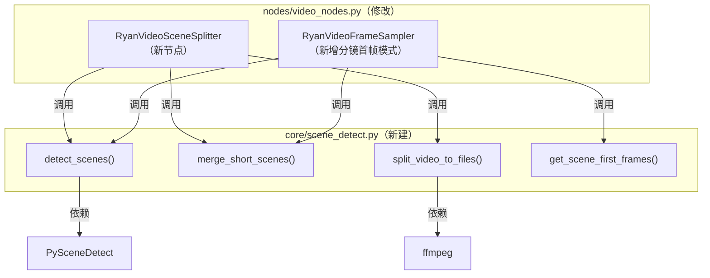
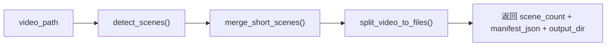

# 视频分镜切割系统 · ComfyUI 节点设计文档

版本：v1.0
日期：2026-07-10
关联参考：`auto_scene_split.py` / `长视频自动分镜切割系统-设计文档.md`

---

## 1. 背景与需求

用户在 ComfyUI 工作流中需要对长视频进行自动分镜切割，主要有两个使用场景：

1. **分镜切割节点**：将一个长视频自动切割成多个分镜短视频文件，按顺序命名保存到指定目录，供后续工作流或外部工具使用。
2. **分镜首帧采样模式**：在现有的 `Ryan Video Frame Sampler` 节点中新增一个采样模式——"分镜首帧"，自动检测视频中的镜头边界，提取每个分镜的第一帧图片作为 IMAGE 张量输出，可直接接入下游的图像处理节点。

两个需求共用同一套底层分镜检测引擎（基于 PySceneDetect），检测逻辑封装在独立的 core 模块中，节点层只做输入/输出的编排。

---

## 2. 总体架构



### 分层职责

| 层 | 文件 | 职责 |
|---|---|---|
| **检测核心** | `core/scene_detect.py`（新建） | 封装分镜检测、短镜头合并、视频切割、首帧提取四个纯函数，不依赖 ComfyUI |
| **节点层** | `nodes/video_nodes.py`（修改） | 新增 `RyanVideoSceneSplitter` 节点类；修改 `RyanVideoFrameSampler` 增加分镜首帧采样模式 |
| **注册层** | `__init__.py`（修改） | 注册新节点的类映射和显示名 |

---

## 3. 依赖管理

### 3.1 PySceneDetect

分镜检测的核心引擎。需要新增依赖：

```
scenedetect>=0.6
```

> [!IMPORTANT]
> PySceneDetect 是纯 Python 包（依赖 OpenCV 和 numpy，项目中已有），安装方式为 `pip install scenedetect`。它**不依赖 GPU**，纯 CPU 即可运行。

### 3.2 ffmpeg

视频切割层依赖系统已安装的 ffmpeg。ComfyUI-aki 发行版通常已自带 ffmpeg，需在运行时校验可用性。

> [!NOTE]
> 如果用户环境缺少 ffmpeg，`split_video_to_files()` 应抛出明确的错误提示（如"请安装 ffmpeg 并确保其在系统 PATH 中"），而不是静默失败。

---

## 4. 核心模块详细设计

### 4.1 `core/scene_detect.py`（新建文件）

#### 4.1.1 `detect_scenes()`

```python
def detect_scenes(
    video_path: str,
    detector: str = "adaptive",    # "content" | "adaptive" | "threshold"
    threshold: float | None = None, # None = 使用检测器默认值
    min_scene_len_sec: float = 0.6,
) -> list[tuple]:
    """
    检测视频中的镜头边界，返回 [(start_timecode, end_timecode), ...] 列表。
    
    检测器选型依据（来自参考设计文档）：
    - adaptive（默认）：滑动窗口自适应阈值，对运镜/手持晃动更鲁棒
    - content：HSV 颜色直方图突变检测，速度快，适合固定机位/硬切较多的素材
    - threshold：亮度阈值检测，仅适合黑场/淡入淡出转场
    
    默认阈值：content=27.0, adaptive=3.0, threshold=12.0
    """
```

#### 4.1.2 `merge_short_scenes()`

```python
def merge_short_scenes(
    scene_list: list[tuple],
    min_duration_sec: float = 1.0,
) -> list[tuple]:
    """
    二次后处理：将时长短于 min_duration_sec 的碎片镜头合并到前一个镜头。
    
    设计依据：真实素材上检测几乎必然产生几帧到零点几秒的"毛刺"碎片（字幕闪烁、
    镜头轻微抖动都可能触发误检），直接并入前一个镜头是无损处理方式。
    """
```

#### 4.1.3 `split_video_to_files()`

```python
def split_video_to_files(
    video_path: str,
    scene_list: list[tuple],
    output_dir: str,
    filename_prefix: str = "scene",
    fast_copy: bool = False,
) -> list[dict]:
    """
    按分镜列表将视频切割为多个独立文件，按顺序命名。
    
    输出文件命名规则：{filename_prefix}_001.mp4, {filename_prefix}_002.mp4, ...
    
    返回值：包含每个分镜元数据的列表
    [
        {
            "scene_number": 1,
            "start_seconds": 0.000,
            "end_seconds": 3.500,
            "duration_seconds": 3.500,
            "file_path": "/path/to/scene_001.mp4"
        },
        ...
    ]
    
    切割模式：
    - fast_copy=False（默认，精确模式）：重新编码，切点精确到帧
    - fast_copy=True（快速模式）：-c copy 不重编码，速度极快但边界对齐到关键帧
    """
```

#### 4.1.4 `get_scene_first_frames()`

```python
def get_scene_first_frames(
    video_path: str,
    scene_list: list[tuple],
    custom_width: int = 0,
    custom_height: int = 0,
) -> torch.Tensor:
    """
    提取每个分镜的首帧图片，返回 [N, H, W, C] 的 float32 张量。
    
    实现方式：使用 OpenCV seek 到每个分镜的 start_seconds，读取一帧，
    转换为 RGB float32 张量。比 ffmpeg 子进程方式更轻量。
    
    可选缩放：如果指定了 custom_width 或 custom_height，使用已有的
    _resize_frame() 进行等比缩放。
    """
```

---

## 5. 节点详细设计

### 5.1 新节点：`RyanVideoSceneSplitter`

**功能定位**：接收视频路径，自动检测分镜并切割保存为多个独立视频文件。

#### INPUT_TYPES

| 参数 | 类型 | 默认值 | 说明 |
|---|---|---|---|
| `video_path` | STRING | `""` | 输入视频路径（前端提供「选择视频文件...」按钮，通过 tkinter 文件对话框选择） |
| `output_dir` | STRING | `"scene_splits"` | 输出目录名（相对于 ComfyUI output 目录） |
| `filename_prefix` | STRING | `"scene"` | 输出文件名前缀 |
| `detector` | COMBO | `"自适应检测"` | 检测器类型：自适应检测 / 内容突变检测 / 亮度阈值检测 |
| `threshold` | FLOAT | 0.0 | 检测灵敏度（0 = 使用检测器默认值） |
| `min_scene_len` | FLOAT | 0.6 | 最短镜头时长（秒） |
| `merge_min_duration` | FLOAT | 1.0 | 碎片合并阈值（秒） |
| `fast_copy` | BOOLEAN | False | 快速模式（不重编码） |

#### RETURN_TYPES / RETURN_NAMES

| 输出 | 类型 | 说明 |
|---|---|---|
| `scene_count` | INT | 切割出的分镜总数 |
| `manifest_json` | STRING | JSON 格式的分镜元数据（每个分镜的编号、时间、路径） |
| `output_dir` | STRING | 输出目录的绝对路径 |

#### CATEGORY

```
Ryan Utils / Video
```

#### 执行流程



#### 中文选项映射表

| 中文选项 | 内部值 |
|---|---|
| 自适应检测 | adaptive |
| 内容突变检测 | content |
| 亮度阈值检测 | threshold |

---

### 5.2 修改节点：`RyanVideoFrameSampler` 新增分镜首帧模式

#### 变更点

1. **`sample_mode` 增加选项**：在现有的四个采样模式之后，新增 `"分镜首帧采样"` 选项。
2. **新增可选输入**：`video_path`（STRING），当 `sample_mode` 选择 `"分镜首帧采样"` 时，需要从原始视频路径做分镜检测（因为分镜检测需要读取视频帧序列来计算帧间差异，不能只靠已加载的 IMAGE 张量）。
3. **新增参数**：
   - `scene_detector`（COMBO，默认 `"自适应检测"`）——检测器类型
   - `scene_threshold`（FLOAT，默认 0.0）——检测灵敏度
   - `scene_min_len`（FLOAT，默认 0.6）——最短镜头时长
   - `scene_merge_min`（FLOAT，默认 1.0）——碎片合并阈值

#### 分镜首帧模式的执行逻辑

```python
# 伪代码
if sample_mode == "分镜首帧采样":
    scene_list = detect_scenes(video_path, detector, threshold, min_scene_len)
    scene_list = merge_short_scenes(scene_list, merge_min_duration)
    sampled = get_scene_first_frames(video_path, scene_list)
    indexes = [scene.start_frame for scene in scene_list]
```

> [!WARNING]
> 分镜首帧模式**必须**提供 `video_path` 输入，因为分镜检测需要原始视频文件（逐帧读取并计算帧间变化分数），仅有已采样的 IMAGE 张量是不够的。当 `video_path` 未提供时，应抛出明确的错误提示。

#### SAMPLE_MODE_MAP 更新

```python
SAMPLE_MODE_MAP = {
    "首尾与均匀采样": "head_tail",
    "完全均匀采样": "uniform",
    "固定间隔采样": "interval",
    "自定义帧索引": "custom_indexes",
    "分镜首帧采样": "scene_first_frame",  # 新增
}
```

#### 前端 JS 适配

在 `ryan_video_frame_sampler.js` 的向后兼容映射表中，增加 `"scene_first_frame": "分镜首帧采样"` 映射。

同时，在前端按需控制与分镜相关的参数的显示/隐藏：当 `sample_mode` 选择 `"分镜首帧采样"` 时，显示 `scene_detector`、`scene_threshold`、`scene_min_len`、`scene_merge_min` 四个参数；其他模式下隐藏这些参数（类似已有的 `prompt_dir` 显隐逻辑）。

---

## 6. 文件变更清单

| 操作 | 文件 | 说明 |
|---|---|---|
| **新建** | `ryan_comfy_utils/core/scene_detect.py` | 分镜检测核心模块 |
| **修改** | `ryan_comfy_utils/nodes/video_nodes.py` | 新增 `RyanVideoSceneSplitter` 节点；修改 `RyanVideoFrameSampler` 增加分镜首帧模式 |
| **修改** | `ryan_comfy_utils/web/ryan_video_frame_sampler.js` | 增加 `scene_first_frame` 的向后兼容映射；增加分镜参数的显隐控制逻辑 |
| **新建** | `ryan_comfy_utils/web/ryan_scene_splitter.js` | 为 `RyanVideoSceneSplitter` 节点提供「选择视频文件...」按钮（tkinter 文件对话框） |
| **修改** | `__init__.py` | 注册 `RyanVideoSceneSplitter` 节点映射 |
| **新建** | `tests/core/test_scene_detect.py` | 分镜检测核心模块的单元测试 |
| **新建** | `tests/nodes/test_scene_splitter_node.py` | `RyanVideoSceneSplitter` 节点的单元测试 |

---

## 7. 节点工作流示例

### 7.1 分镜切割工作流

```
[Ryan Batch Video Loader] → video_path → [Ryan Video Scene Splitter]
                                              ↓
                                         scene_count (INT)
                                         manifest_json (STRING)
                                         output_dir (STRING)
```

### 7.2 分镜首帧采样 + 图片拆分工作流

```
[Ryan Batch Video Loader] → images → [Ryan Video Frame Sampler (分镜首帧采样)]
                          → video_path ↗        ↓
                                            images (IMAGE batch)
                                                ↓
                                     [Ryan Image Batch Splitter]
                                          ↓        ↓        ↓
                                     image_01  image_02  image_03 ...
```

---

## 8. 测试计划

### 8.1 单元测试

| 测试文件 | 覆盖内容 |
|---|---|
| `test_scene_detect.py` | `detect_scenes()` 返回值结构、`merge_short_scenes()` 合并逻辑、`get_scene_first_frames()` 张量形状 |
| `test_scene_splitter_node.py` | 节点 INPUT_TYPES / RETURN_TYPES 合约、中文选项映射、mock 调用链 |

### 8.2 集成验证

1. 用 ffmpeg 生成一段合成测试视频（如红/蓝/绿/黄四色拼接，每段 2 秒，共 8 秒），验证：
   - `RyanVideoSceneSplitter` 正确切割出 4 个分镜文件
   - `RyanVideoFrameSampler` 分镜首帧模式正确输出 4 张首帧图片
2. 在 ComfyUI 中手动运行工作流，确认节点间数据流通正常

---

## 9. 已决策问题

### 9.1 PySceneDetect 安装方式

**决策**：直接依赖，写入 `requirements.txt`。

安装本节点包即默认安装 PySceneDetect，在 `core/scene_detect.py` 顶部直接 `import`：

```python
from scenedetect import open_video, SceneManager
from scenedetect.detectors import ContentDetector, AdaptiveDetector, ThresholdDetector
```

同时在项目根目录的 `requirements.txt` 中添加：

```
scenedetect>=0.6
```

### 9.2 `video_path` 输入交互方式

**决策**：使用 tkinter 文件对话框（「选择视频文件...」按钮），复用已有的 tkinter 后端 API 模式。

新增 API 端点 `/ryan_comfy_utils/select_video_file`，弹出系统文件选择对话框让用户选择视频文件，前端按钮点击后调用该端点并将返回路径填入输入框。

`video_path` 在 `RyanVideoFrameSampler` 中设为 **optional 输入**，仅当 `sample_mode` 为"分镜首帧采样"时校验其存在。同时也可通过连线从 `Ryan Batch Video Loader` 节点获取。

